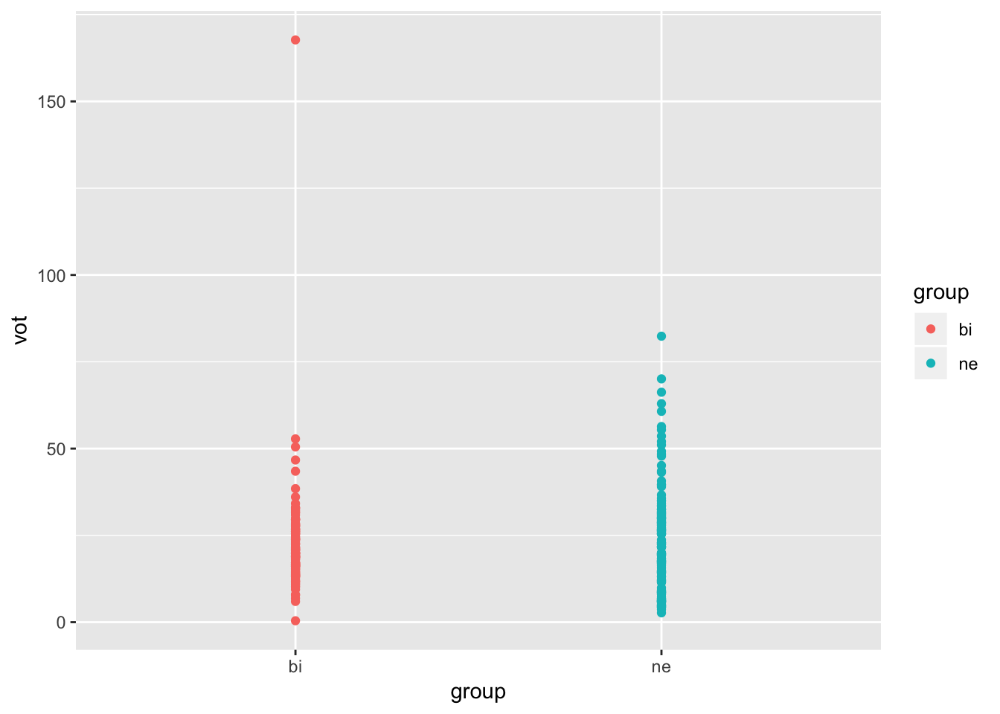
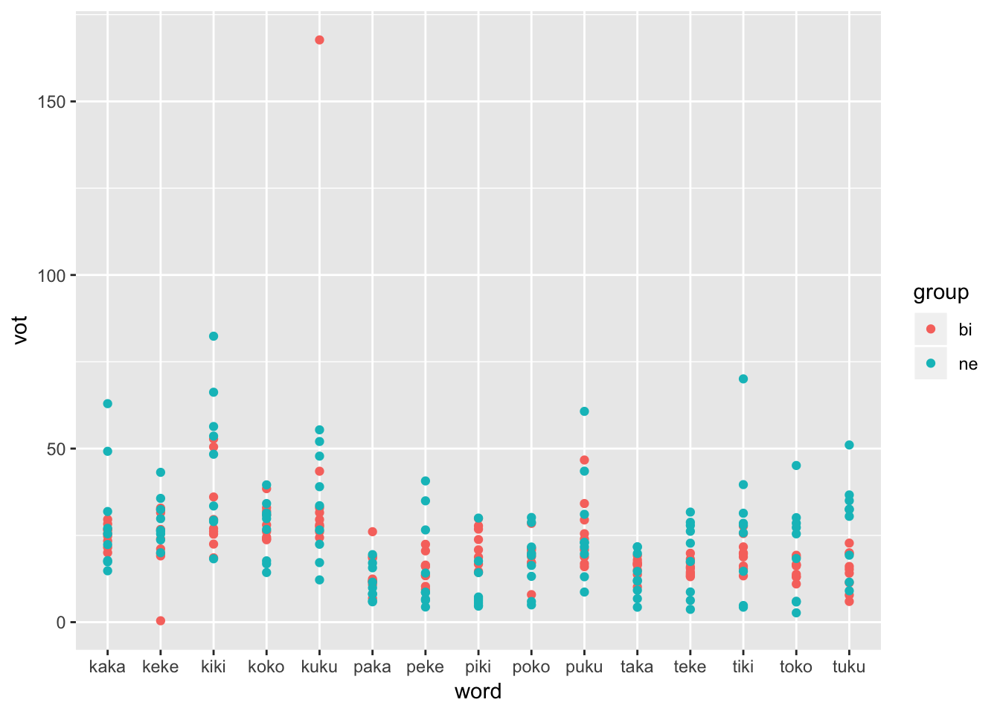
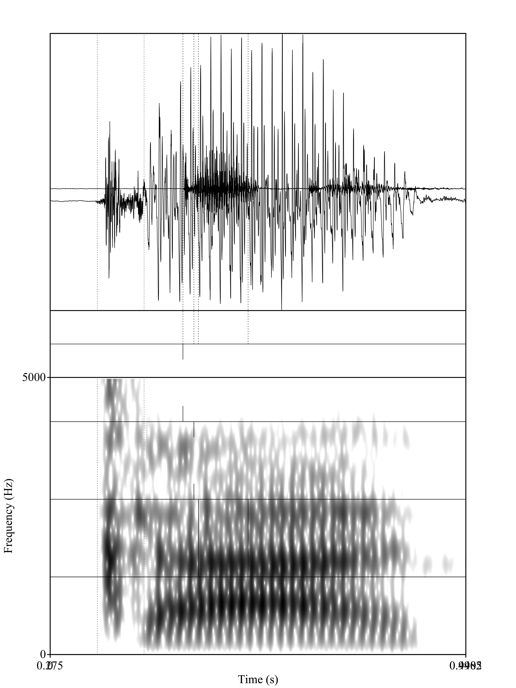
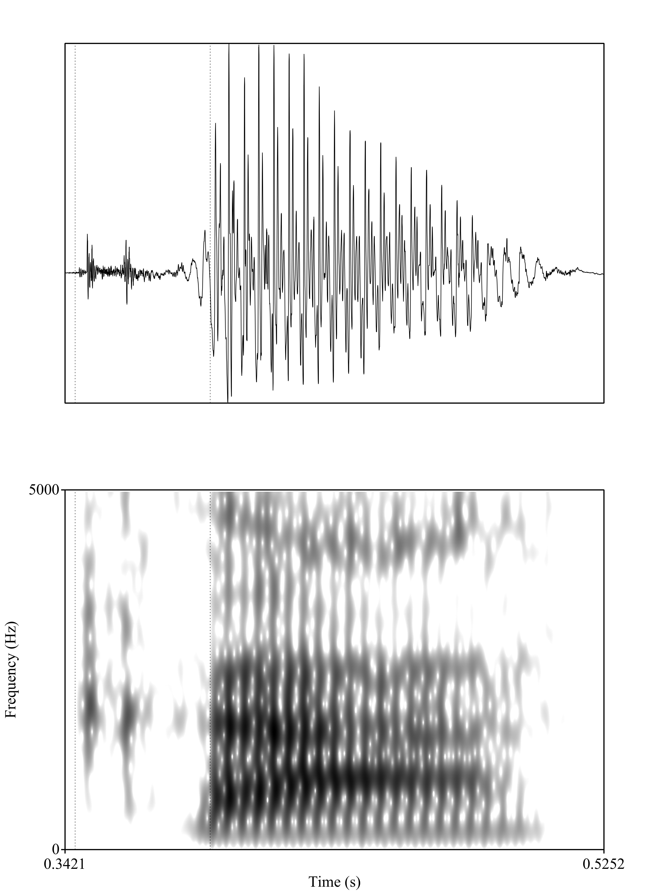
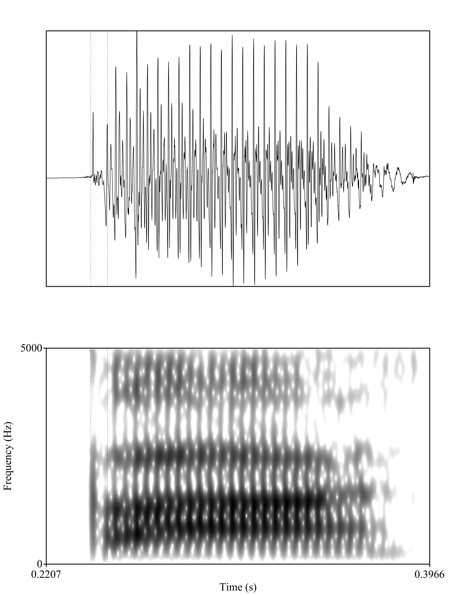
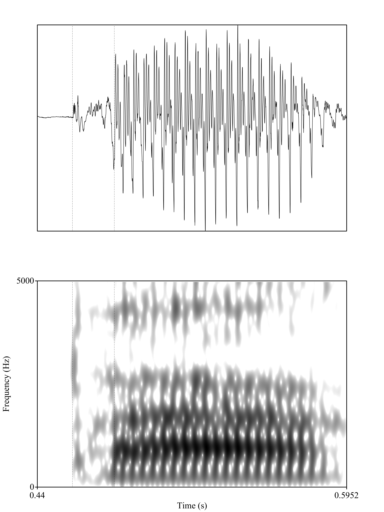

Programming Assignment 4
================

**Author**: Jessica Varela **Date**: Last update: 2020-04-22 09:47:15

Overview
========

<!-- 
Description
-->
In this programming assignment we received data from 3 bilinguals and 2 native english speakers saying different words. I was able to segment each of the sounds, and fix the scripts to end up with 6 separate csv files that had each of the participants, f1, f2 and vot.

Given that I hypothesize that there will be differences between both groups. Native English speakers will have longer VOT, bilinguals will have shorter VOT than the native English speakers.

Prep
====

``` r
## Libraries
library(tidyverse)
```

    ## ── Attaching packages ───────────────────── tidyverse 1.2.1 ──

    ## ✔ ggplot2 3.1.1       ✔ purrr   0.3.3  
    ## ✔ tibble  2.1.1       ✔ dplyr   0.8.0.1
    ## ✔ tidyr   0.8.3       ✔ stringr 1.4.0  
    ## ✔ readr   1.3.1       ✔ forcats 0.4.0

    ## ── Conflicts ──────────────────────── tidyverse_conflicts() ──
    ## ✖ dplyr::filter() masks stats::filter()
    ## ✖ dplyr::lag()    masks stats::lag()

``` r
library(knitr)
library(dplyr)
```

``` r
## Load data
bi01 <- read_csv("../data/bi01.csv")
```

    ## Parsed with column specification:
    ## cols(
    ##   fileID = col_character(),
    ##   f1 = col_double(),
    ##   f2 = col_double(),
    ##   vot = col_double(),
    ##   notes = col_character()
    ## )

``` r
bi02 <- read_csv("../data/bi02.csv")
```

    ## Parsed with column specification:
    ## cols(
    ##   fileID = col_character(),
    ##   f1 = col_double(),
    ##   f2 = col_double(),
    ##   vot = col_double(),
    ##   notes = col_logical()
    ## )

``` r
bi03 <- read_csv("../data/bi03.csv")
```

    ## Parsed with column specification:
    ## cols(
    ##   fileID = col_character(),
    ##   f1 = col_double(),
    ##   f2 = col_double(),
    ##   vot = col_double(),
    ##   notes = col_logical()
    ## )

``` r
ne01 <- read_csv("../data/ne01.csv")
```

    ## Parsed with column specification:
    ## cols(
    ##   fileID = col_character(),
    ##   f1 = col_double(),
    ##   f2 = col_double(),
    ##   vot = col_double(),
    ##   notes = col_logical()
    ## )

``` r
ne02 <- read_csv("../data/ne02.csv")
```

    ## Parsed with column specification:
    ## cols(
    ##   fileID = col_character(),
    ##   f1 = col_double(),
    ##   f2 = col_double(),
    ##   vot = col_double(),
    ##   notes = col_logical()
    ## )

``` r
ne03 <- read_csv("../data/ne03.csv")
```

    ## Parsed with column specification:
    ## cols(
    ##   fileID = col_character(),
    ##   f1 = col_double(),
    ##   f2 = col_double(),
    ##   vot = col_double(),
    ##   notes = col_logical()
    ## )

``` r
data <- bind_rows(bi01, bi02, bi03, ne01, ne02, ne03)
```

Tidy data
---------

``` r
# Convert from long to wide or wide to long format as necessary (check 
# examples from class)
# Create any other relevant variables here 

data = separate(data = data, col = fileID, into = c("id", "word"), sep = "_")

data = separate(data = data, col = word, into = c("word", "trial"), sep = "(?<=[A-Za-z])(?=[0-9])", extra = "drop", fill = "right")

data = separate(data = data, col = id, into = c("group", "id"), sep = "(?<=[A-Za-z])(?=[0-9])", extra = "drop", fill = "right")

glimpse(data)
```

    ## Observations: 270
    ## Variables: 8
    ## $ group <chr> "bi", "bi", "bi", "bi", "bi", "bi", "bi", "bi", "bi", "bi"…
    ## $ id    <chr> "01", "01", "01", "01", "01", "01", "01", "01", "01", "01"…
    ## $ word  <chr> "kaka", "kaka", "kaka", "keke", "keke", "keke", "kiki", "k…
    ## $ trial <chr> NA, "1", "2", NA, "1", "2", NA, "1", "2", NA, "1", "2", NA…
    ## $ f1    <dbl> 650.90, 714.32, 709.19, 495.24, 893.01, 579.31, 823.90, 34…
    ## $ f2    <dbl> 1637.02, 1567.58, 1560.03, 2168.42, 2152.98, 2339.40, 2711…
    ## $ vot   <dbl> 24.81, 25.49, 28.29, 31.55, 32.39, 32.87, 18.54, 52.80, 50…
    ## $ notes <chr> NA, NA, NA, NA, NA, NA, NA, NA, NA, NA, NA, NA, NA, NA, "e…

Analysis
========

Descriptives
------------

``` r
# Give some descriptive summaries of your data 
# Display your descriptives in a table

table <-data %>%
  group_by(group, word) %>%
  summarize(meanf1 = mean(f1), sdf1 = sd(f1), meanf2 = mean(f2), sdf2 = sd(f2), meanvot = mean(vot), sdvot = sd(vot), n = n() )
kable(table, caption = "table")
```

| group | word |    meanf1|       sdf1|     meanf2|       sdf2|   meanvot|      sdvot|    n|
|:------|:-----|---------:|----------:|----------:|----------:|---------:|----------:|----:|
| bi    | kaka |  765.9711|  144.30254|  1602.2244|  122.06547|  25.15333|   3.096538|    9|
| bi    | keke |  565.5411|  130.47678|  2290.3767|  115.70618|  23.09111|  10.082464|    9|
| bi    | kiki |  421.1633|  159.11674|  2675.4211|   45.74801|  32.04111|  12.105523|    9|
| bi    | koko |  575.1044|   83.52606|   988.5633|  104.85991|  28.96222|   5.001252|    9|
| bi    | kuku |  394.1500|   97.43794|  1066.6089|  344.88098|  45.69000|  46.095855|    9|
| bi    | paka |  733.9733|  177.00532|  1600.4789|  180.60793|  14.32111|   5.771348|    9|
| bi    | peke |  555.0889|  160.95561|  2273.1978|  190.96934|  15.37222|   4.283558|    9|
| bi    | piki |  535.2422|  485.75673|  2559.8944|  377.36435|  21.50111|   5.819058|    9|
| bi    | poko |  531.3256|   82.92409|  1092.1967|  306.55446|  19.20111|   5.388948|    9|
| bi    | puku |  470.7689|   78.97721|   945.4067|  311.53910|  25.80222|   9.836860|    9|
| bi    | taka |  691.7256|  183.79081|  1566.3756|   98.81015|  15.90778|   2.669905|    9|
| bi    | teke |  494.0189|   78.30150|  2252.9344|  283.03867|  15.72222|   2.296959|    9|
| bi    | tiki |  496.7689|  186.73792|  2424.7400|  280.88930|  19.79778|   4.657934|    9|
| bi    | toko |  623.2333|  118.20603|  1039.1378|   80.58253|  15.37111|   2.792684|    9|
| bi    | tuku |  482.4133|   82.85790|   869.2244|  104.23037|  14.78667|   5.660585|    9|
| ne    | kaka |  769.0900|  290.55363|  1724.8444|  219.65436|  29.86444|  16.149961|    9|
| ne    | keke |  530.2600|   82.20847|  2408.0422|  275.23719|  29.20333|   7.013541|    9|
| ne    | kiki |  450.6633|  198.82004|  2647.4544|  253.55407|  46.33333|  20.598332|    9|
| ne    | koko |  557.0489|   76.97462|  1085.1833|   54.06274|  26.80889|   8.679714|    9|
| ne    | kuku |  568.9933|  248.70631|  1195.8533|  354.12179|  34.02222|  15.607314|    9|
| ne    | paka |  820.2556|  101.87143|  1692.2956|  157.23805|  11.30778|   4.968427|    9|
| ne    | peke |  533.6367|  103.29868|  2383.9078|  351.92548|  16.76111|  13.714666|    9|
| ne    | piki |  388.9544|   29.95836|  2606.6389|  314.66528|  10.77889|   8.501990|    9|
| ne    | poko |  626.2633|  154.06409|  1273.5189|  368.48876|  17.77222|   8.810574|    9|
| ne    | puku |  492.2989|  127.37091|  1101.4989|  122.45099|  27.13889|  16.087693|    9|
| ne    | taka |  825.4711|  200.50626|  1636.7822|  188.91881|  13.55000|   6.403948|    9|
| ne    | teke |  577.5000|   82.62331|  2137.3856|  401.15839|  19.27222|  10.638162|    9|
| ne    | tiki |  355.7922|   42.92257|  2568.3244|  531.80242|  27.45111|  19.990093|    9|
| ne    | toko |  552.2889|   58.28917|  1070.4411|   71.08145|  21.03667|  14.042711|    9|
| ne    | tuku |  542.2956|  214.65697|  1217.3611|  212.88338|  28.67111|  13.245302|    9|

``` r
table1 <-data %>%
  group_by(group) %>%
  summarize(mean(vot), sd(vot), n = n() ) 
kable(table1, caption = "table1")
```

| group |  mean(vot)|   sd(vot)|    n|
|:------|----------:|---------:|----:|
| bi    |   22.18141|  15.15063|  135|
| ne    |   23.99815|  15.53171|  135|

``` r
table2 <-data %>%
  group_by(group, word) %>%
  summarize(mean(vot), sd(vot))
kable(table2, caption = "table2")
```

| group | word |  mean(vot)|    sd(vot)|
|:------|:-----|----------:|----------:|
| bi    | kaka |   25.15333|   3.096538|
| bi    | keke |   23.09111|  10.082464|
| bi    | kiki |   32.04111|  12.105523|
| bi    | koko |   28.96222|   5.001252|
| bi    | kuku |   45.69000|  46.095855|
| bi    | paka |   14.32111|   5.771348|
| bi    | peke |   15.37222|   4.283558|
| bi    | piki |   21.50111|   5.819058|
| bi    | poko |   19.20111|   5.388948|
| bi    | puku |   25.80222|   9.836860|
| bi    | taka |   15.90778|   2.669905|
| bi    | teke |   15.72222|   2.296959|
| bi    | tiki |   19.79778|   4.657934|
| bi    | toko |   15.37111|   2.792684|
| bi    | tuku |   14.78667|   5.660585|
| ne    | kaka |   29.86444|  16.149961|
| ne    | keke |   29.20333|   7.013541|
| ne    | kiki |   46.33333|  20.598332|
| ne    | koko |   26.80889|   8.679714|
| ne    | kuku |   34.02222|  15.607314|
| ne    | paka |   11.30778|   4.968427|
| ne    | peke |   16.76111|  13.714666|
| ne    | piki |   10.77889|   8.501990|
| ne    | poko |   17.77222|   8.810574|
| ne    | puku |   27.13889|  16.087693|
| ne    | taka |   13.55000|   6.403948|
| ne    | teke |   19.27222|  10.638162|
| ne    | tiki |   27.45111|  19.990093|
| ne    | toko |   21.03667|  14.042711|
| ne    | tuku |   28.67111|  13.245302|

Visualization
-------------

``` r
# Include some plots here
# Plot 1

ggplot(data, aes(x = group, y = vot)) +
  geom_point(aes(color = group))
```



``` r
# Include some plots here
# PLot 2

ggplot(data, aes(x = word, y = vot)) +
  geom_point(aes(color = group))
```



For example, VOT for kaka from bilingual speakers was .025153 or 25 ms and the figure is shown below: Visual 1 

However, the mean average VOT for kaka from native english speakers was 29.86444 ms, which was longer than the VOT from the bilingual, but not by a lot. The figure is shown below. Visual 2 

Here is another example, this word is paka, and a bilingual speaker's VOT was 7 ms. Visual 3



However, for a native english speaker for the word paka, the VOT was 12 ms, double the time of the bilingual speaker's. Visual 4



Hypothesis test
---------------

``` r
# Conduct a simple statistical analysis here (optional)
```

Conclusion
==========

<!-- 
Revisit your hypotheses (refer to plots, figures, tables, statistical tests, 
etc.)

Reflect on the entire process. 
What did you enjoy? What did you hate? What did you learn? 
What would you do differently?
-->
In conclusion, my hypothesis was correct over all. Native English speakers seem to have longer lag VOT's than bilniguals. The mean VOT for the bilingual group was 22, whereas the mean VOT for the native english group was 24. The standard deviation for the bilingual group was 15, and for the native english group it was 16. If you look at the first plot, you can see that overal the bilingual group 9 (in pink) had shorter VOTs than the native english group (in green). Referring back to the second plot, you can see how each group did with each of the words that had p,t,k stop constonants. There were a couple of outliers for the bilingual groups. This plot shows you how each group did with each word, and again, native english speakers show longer VOTs than bilinguals.

This programming assignment has been the one that really made me feel like I didn't know where to start. However, it was fun having to figure out how to make a code work, researching online to make the code word, and sometimes it was just a matter of a missing comma or a misspelled word. I hated not being able to run any statistical analyses, and I would love to learn how to do this in the future becuase it is essential in research. I learned so much coding this semester and through these programming assignments. Specifically with this programming assignment I learned how to input png files in the rmarkdown, as well as creating tables and separating data. I think I would expand my hypothesis to the consonants and seek additional information regarding the separate consonants.
